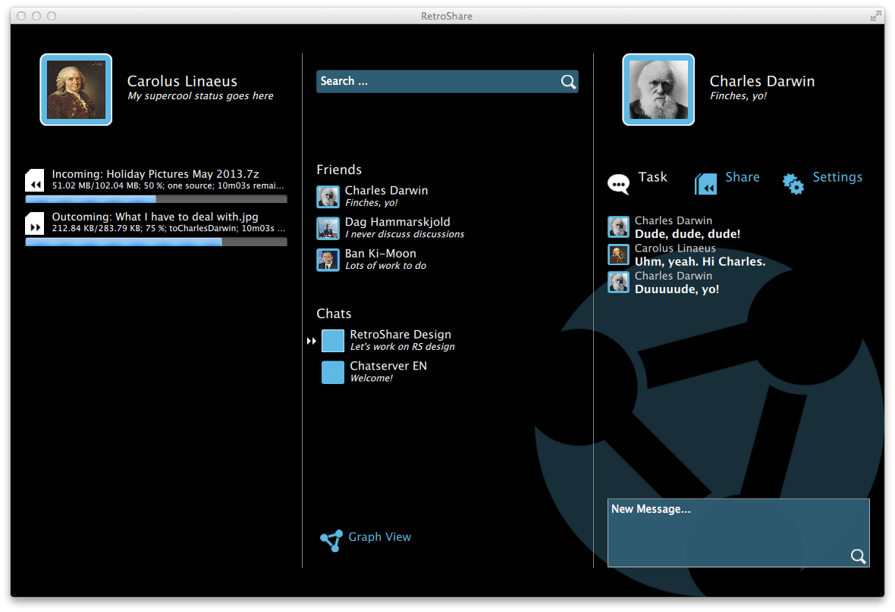

RS-QML-GUI
==========

Retroshare GUI implementation in QML.

The GUI has been created in Qt 5.3.1.

Current issues:
- need to add horizontal scroll for the 3 columns in order to adapt to different
  screen widths. Also, some columns should be hidden, depending on user prefs
- Share and Settings tabs need to be defined
